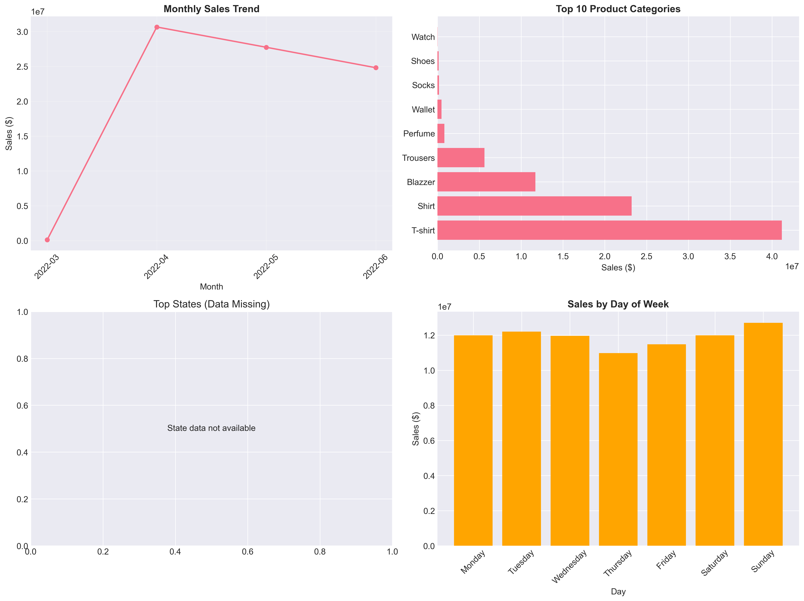

# Amazon-sales-analysis
Comprehensive analysis of Amazon sales data
# 📊 Amazon Sales Report Analysis

## 🎯 Project Overview
Comprehensive analysis of Amazon sales data to extract actionable business insights for decision-making.

## 📋 Project Objectives
1. **Sales Performance Analysis** - Identify trends and patterns
2. **Product Category Analysis** - Find popular products and sizes
3. **Geographical Distribution** - Analyze sales by state/city
4. **Customer Segmentation** - Group customers by behavior
5. **Business Recommendations** - Provide actionable insights

## 📁 Project Structure

## 🚀 How to Run This Project

### Prerequisites
- Python 3.7 or higher
- Jupyter Notebook

### Installation
1. Clone this repository:
```bash
git clone https://github.com/Akshitha-gif06/-amazon-sales-analysis
cd amazon-sales-analysis

pip install -r requirements.txt

jupyter notebook Amazon_Sales_Analysis.ipynb


**Save the file.**

---

## **PART 6: UPLOAD TO GITHUB**

### **Step 11: Upload via GitHub Desktop**
1. Open GitHub Desktop
2. You should see your repository already selected

3. In the left panel, you'll see:
   - **Changes** tab - shows files you've added/modified
   - **History** tab - shows previous commits

4. **Commit your changes:**
   - In "Summary" field, type: `Initial commit - Complete Amazon Sales Analysis`
   - In "Description" field (optional), type: `Includes Jupyter notebook, dataset, visualizations, and analysis`
   - Click **"Commit to main"**

5. **Push to GitHub:**
   - Click **"Push origin"** button (top right)
   - Wait for it to complete

### **Step 12: Verify Upload**
1. Go to your GitHub repository page

2. You should see all your files!
3. Click on each file to verify they uploaded correctly

---

## **PART 7: ADD VISUALIZATIONS TO README**

### **Step 13: Upload Images to GitHub**
1. Go to your repository on GitHub
2. Click **"Add file" → "Upload files"**
3. Drag and drop your `sales_analysis_summary.png`
4. Add commit message: `Add analysis visualizations`
5. Click **"Commit changes"**

### **Step 14: Make README More Visual**
Update your README.md again (in GitHub Desktop):

```markdown
## 📊 Sample Visualizations

### 1. Monthly Sales Trend


### 2. Code Snippet Example
```python
# Sales analysis code
total_sales = df['Amount'].sum()
print(f"Total Sales: ${total_sales:,.2f}")
